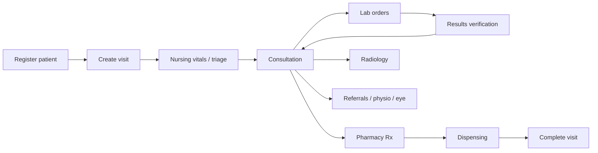

# Clinical visit lifecycle

End-to-end flow from patient registration through module handoffs. Use this for onboarding and integration testing.

## High-level flow

## 1. Medical records — patient & visit

| Step | UI path | API (typical) |
|------|---------|---------------|
| Register patient | `/medical-records/patients/new` | `POST /api/v1/patients/` |
| Search / manage | `/medical-records/patients` | `GET /api/v1/patients/` |
| View record | `/medical-records/patient-records` | `GET /api/v1/patients/{id}/` |
| Create visit | `/medical-records/visits/new` | `POST /api/v1/visits/` |
| Manage visits | `/medical-records/visits` | `GET/PATCH /api/v1/visits/` |

**RBAC:** Creating patients/visits requires medical-records write pages; patient **detail** is readable by any clinical module holder.

## 2. Nursing

| Step | UI path | API |
|------|---------|-----|
| Pool / room queue | `/nursing/pool-queue`, `/nursing/room-queue` | `nursing/` APIs |
| Record vitals | `/nursing/patient-vitals`, `/nursing/vitals-history` | `POST /api/v1/vitals/` |
| Procedures | `/nursing/procedures` | `nursing/procedures/` |

Vitals **writes** require nursing or consultation write pages; reads are broader.

## 3. Consultation

| Step | UI path | API |
|------|---------|-----|
| Start | `/consultation/start` | Consultation session + visit linkage |
| Room workspace | `/consultation/room/[roomId]` | `consultation/` APIs |
| Orders | In consultation UI | Lab, pharmacy, radiology, physio, nursing orders |

Consultation creates orders that appear in downstream module queues.

## 4. Laboratory

| Step | UI path | API |
|------|---------|-----|
| Order queue | `/laboratory/orders` | `laboratory/orders/` |
| Collect / process | Lab workflow pages | order status transitions |
| Verify results | `/laboratory/verification` | result verification actions |
| Completed | `/laboratory/completed` | read-only completed |

External analyzers (e.g. URIT 5160) post results via [integration/urit5160/README.md](../../integration/urit5160/README.md).

## 5. Pharmacy

| Step | UI path | API |
|------|---------|-----|
| Prescription queue | `/pharmacy/prescriptions` | `pharmacy/prescriptions/` |
| Dispense | Prescription detail | dispensing endpoints |
| Inventory | `/pharmacy/inventory`, `/pharmacy/store` | inventory APIs |

See [PHARMACY.md](PHARMACY.md) for strength/topical rules.

## 6. Radiology

| Step | UI path | API |
|------|---------|-----|
| Orders | `/radiology/orders` | `radiology/orders/` |
| Verification | `/radiology/verification` | report verify |
| Viewer / studies | `/radiology/viewer`, `/radiology/studies` | imaging assets via protected media |

## 7. Completion

Visits move through statuses managed in medical records and consultation modules. Ward admissions (`/nursing/wards`) follow a parallel path for inpatients.

## Module-specific deep dives

- [PHYSIOTHERAPY.md](PHYSIOTHERAPY.md) — consultation → physio queue → sessions
- [PHARMACY.md](PHARMACY.md) — medication catalog rules

## Related

- [architecture/AUTH_AND_RBAC.md](../architecture/AUTH_AND_RBAC.md)
- [api/README.md](../api/README.md)
